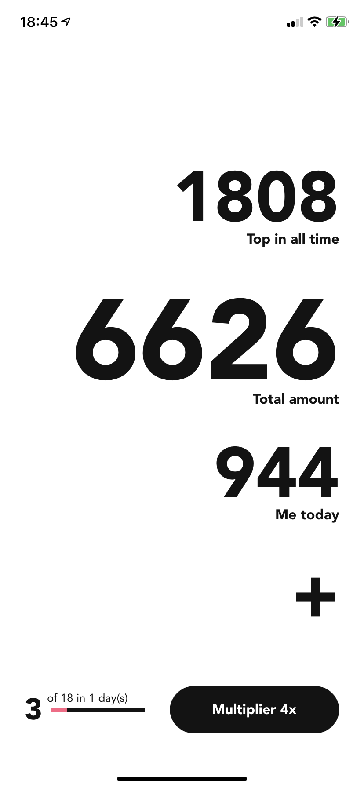
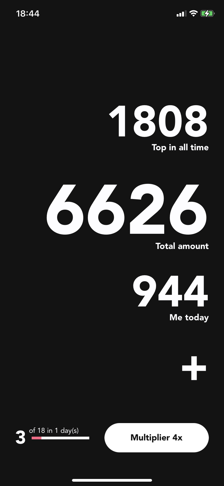

# Useless Counter

<p align="center">
	
	
	
</p>

## Features

- In-App Purchases with StoreKit
- [Lasso Architecture](https://github.com/ww-tech/lasso)
- UI in code with [SnapKit](https://github.com/SnapKit/SnapKit)
- Dependency injection with [DITranquility](https://github.com/ivlevAstef/DITranquillity)
- Simple [Networking](https://github.com/3lvis/Networking) layer with [PromiseKit](https://github.com/mxcl/PromiseKit)
- Generate assets with [R.swift](https://github.com/mac-cain13/R.swift.Library)
- Linted with [Swiftlinter](https://github.com/realm/SwiftLint)

## Requirements

- iOS 13+
- Swift 5

## Installation

1. Clone this repository:
	```bash
	$ git clone git@github.com:alobanov11/UselessScore.git
	```
2. Rename `Constants.plist.tmp` file to `Constants.plist`:
	```bash
	$ cd UselessScore/Resources
	$ mv Constants.plist.tmp Config.plist
	```
3. Open `UselessScore.xcodeproj` in the Xcode.
4. Put your *data* to the `Constants.plist` file.

## History and Plans

- [x] Create and upload to AppStore
- [ ] Create Map Screen with markers of players
- [ ] Integrate fastlane / firebase
- [ ] Add Analytics layer
- [ ] Add UI / Unit tests
- [ ] SwiftUI

## Links

- [AppStore](https://itunes.apple.com/app/id1533690813)
- [Site](https://alobanov11.ru/)
